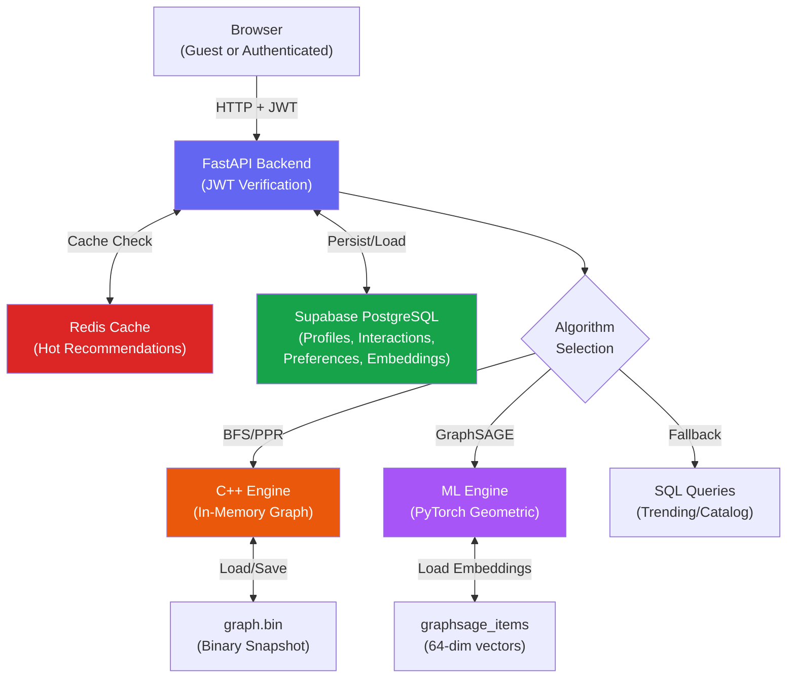
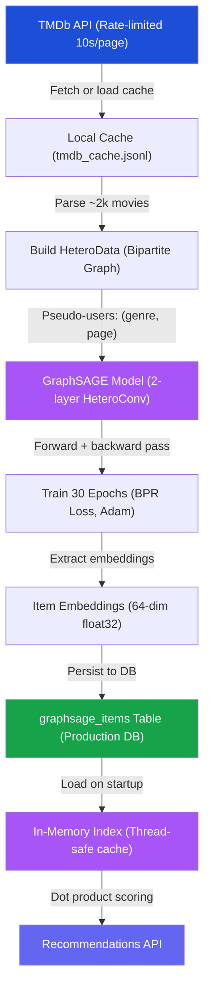

# **System Architecture**

## **High-Level Design**


---  

## **Authentication & Authorization Layer**

### **JWT Flow**
1. **Registration** (`POST /auth/register`):
   - Frontend calls Supabase Auth `signUp(email, password)`
   - Supabase creates auth user, returns UUID
   - Backend receives UUID + email, creates profile with smallest available `user_id` (1, 2, 3, ...)
   - Frontend redirected to own profile (auto-login)

2. **Login** (`GET /auth/user-id`):
   - Frontend calls Supabase Auth `signInWithPassword()`
   - Supabase returns access token (JWT)
   - Frontend sends JWT to `GET /auth/user-id`
   - Backend verifies JWT signature using `SUPABASE_JWT_SECRET`, maps UUID → `user_id`
   - Frontend sets `AppState.myId = user_id` and `AppState.viewingId = user_id`

3. **Protected Endpoints** (POST/DELETE `/interaction/`):
   - Frontend includes JWT: `Authorization: Bearer <token>`
   - Backend verifies JWT, extracts UUID, looks up `user_id`
   - Enforces ownership: `current_user_id == request_body.user_id`
   - Only owner can modify their own data

### **Permission Model**
```javascript
canEdit() = (myId != null && myId == viewingId)
```  
- Guest Mode: myId = null, can view all profiles (read-only), see recs (public read)
- Logged In: myId = assigned_user_id, can edit own profile, view others (read-only)
- Granular Checks: All mutations on /interaction/ and /recommend/preferences require JWT + ownership verification  

---  

## **Data Flow**  

**1. Read Path (Recommendations)**  
  1. User Check: Verify JWT and map to user_id. If guest, use viewingId.
  2. Check Cache: Query Redis for rec:{user_id}:{algo}:{k}. If found, return (<1ms).
  3. Algorithm Selection: If cache miss, call C++ Engine with user's genre preferences:
    - Weighted BFS: Traverses neighbor history with Time-Decay + Genre Boosting.
    - PageRank: Simulates 10,000 random walks, respecting genre preferences.
  4. Fallback Chain:
    - Graph returns empty? → Query SQL for Global Trending
    - Trending empty? → Return Catalog items
  5. Write-Back: Save result to Redis with 1-hour TTL.  

**2. Write Path (Interactions)**  
  1. Auth: Verify JWT signature, extract user_id
  2. Permission: Confirm user_id matches request body
  3. Mutation: Insert/delete row in interactions table
  4. Graph Update: Call C++ Engine to add/remove edge
  5. Cache Invalidate: Delete all rec:{user_id}: keys from Redis
  6. Response: Return success or 403/401 on auth/permission failure  

**3. Preference Update**  
  1. Auth: Verify JWT
  2. Permission: Confirm myId == request_body.user_id
  3. Smart Sync: Compare existing preferences with new ones
    - Add missing genre rows
    - Remove de-selected genres
    - No unnecessary ID churn
  4. Cache Invalidate: Delete rec:{user_id}: keys
  5. Frontend Reload: Genre tag buttons update immediately   

**4. Fast Startup (Binary Serialization)**    
  1. Check DB: Backend queries graph_snapshots table for a binary blob.  
  2. Download: If found, writes bytes to local graph.bin.  
  3. Load: C++ Engine memory-maps graph.bin into std::unordered_map.  
    - *Result: O(DiskSpeed) instead of O(E * QueryLatency)*  
  4. Sync: Even with snapshot loaded, replay all current SQL interactions to ensure freshness.  
  5. On Shutdown: Serialize in-memory graph back to `graph.bin` and store in DB. 

---  

## **Component Breakdown**  

| Component | Technology | Role |
|-----------|-----------|------|
| **Auth** | Supabase Auth + JWT | User registration, login, token verification |
| **API** | FastAPI | HTTP routing, auth middleware, response serialization |
| **Graph Engine** | C++ (Pybind11) | BFS, PageRank, binary serialization |
| **ML Engine** | PyTorch Geometric | GraphSAGE inference, embedding lookup, similarity scoring |
| **Primary Storage** | Supabase (PostgreSQL) | Profiles, interactions, preferences, embeddings, snapshots |
| **Cache** | Redis (Upstash) | Recommendation results, invalidation on user edits |
| **Graph State** | Binary blob (graph.bin) | In-memory graph serialized to disk for $O(1)$ startup |
| **ML State** | In-memory embeddings | Loaded from `graphsage_items` table, thread-safe singleton cache |
| **Training Data** | TMDb API + JSONL cache | ~2k movies (1995-2023), 7 genres, cached locally |
| **Frontend** | Vanilla JS + HTML/CSS | UI, client-side auth, API calls, algorithm switcher |  
  
---  

## **ML Pipeline Architecture**


### **Training (One-Time, Local):**  
1. Fetch movies from TMDb API (or load from cache)  
2. Build bipartite interaction graph with pseudo-users  
3. Train GraphSAGE with BPR loss (30 epochs, Adam optimizer)  
4. Save embeddings to production database  

### **Serving (Runtime, Zero External Calls):**  
1. Load embeddings from `graphsage_items` table on startup  
2. Cache in-memory with thread-safe singleton  
3. Match user's liked items to cached embeddings  
4. Compute user embedding as mean of liked-item embeddings  
5. Score all unseen items via dot product  
6. Return top-K sorted by similarity  

**Cold Start:** Falls back to TMDb popularity ranking if user has no interaction history.  

---  


  